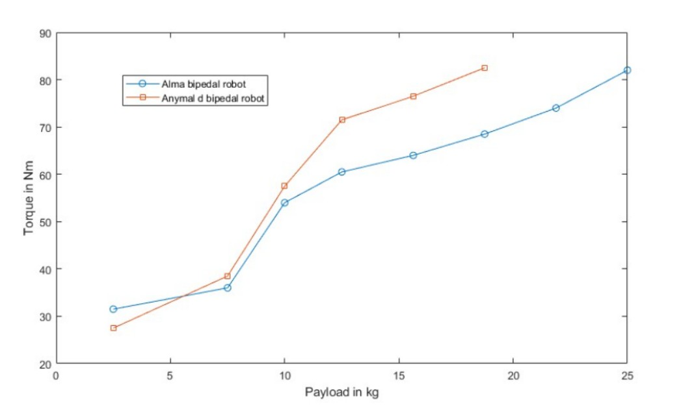

# Alma Robot Bipedal Locomotion Enhancement Using Reinforcement Learning

This project builds on the open-source framework provided by the [legged_gym repository](https://github.com/leggedrobotics/legged_gym), developed by the Robotic Systems Lab at ETH Zurich.

This project extends the Alma robot’s bipedal locomotion capabilities by leveraging its **manipulator as a stabilizing support leg**, freeing the front legs for advanced manipulation. To reach complex control behaviors like **goal-directed walking**, we implemented **progressive learning** within a **multi-task reinforcement learning** framework.

## 📌 Motivation

Quadrupedal robots like ANYmal are excellent for locomotion, but their manipulators are usually unused during motion. By using the manipulator as a stabilizing leg, Alma transitions to a **tripodal configuration** that:
- Maintains balance during bipedal motion.
- Frees two legs for manipulation.
- Improves payload handling during movement.

To train these behaviors, we needed:
- Modular task learning (linear velocity, angular velocity, goal reaching).
- A mechanism to schedule learning focus over time.
- Scalable reward computation for thousands of environments.

---

## 🧠 Key Contributions

1. **Multi-task reward architecture** using `ProgressiveRewardManager` with:
   - Task-specific rewards (e.g., `linear_velocity_tracking`, `angular_tracking`).
   - Shared shaping rewards (e.g., orientation, torque, collisions).
   - Task encoder in observations (optional).

2. **Progressive learning scheduler**:
   - Tracks learning progress of each task.
   - Dynamically updates training probability distribution.
   - Balances exploration (ε-greedy sampling) and exploitation.

3. **Dual-policy controller vs. Multi-task policy** comparison.

4. Addition of a wheel at the end of the manipulator to facilitate rotation and translation.
---
## 📽️ Demonstration Videos
- [Kangaroo Motion](https://drive.google.com/file/d/1SFiUKoMaFAM3-51EOSN1fD06h9Dt28j_/view?usp=sharing)
- [Jugling](https://drive.google.com/file/d/1k-zf7CSnbp7WppjwLc7x-QW-uGW0GNtk/view?usp=sharing)
- [Linear Velocity Tracking](https://drive.google.com/file/d/1a5OQ3h-EqsLgHSbQBkzWTKuQnLkOkMKw/view?usp=sharing)  
- [Progressive Learning Evolution](https://drive.google.com/file/d/1zVHx9hkG_-8_PjoseDZ5p9DdMOGVbMbP/view?usp=sharing)  
- [Dual Policy Goal Controller](https://drive.google.com/file/d/1CYQPU5FbiUqJYAh9tYlhHY-rACM8aCLW/view?usp=sharing)

---
## 🗂️ Main Code Contributions

The core implementation of progressive learning and task control was made in the following locations:

### 1. `legged_gym/rewards/reward_manager_progressive_learning.py`
- Implements per-task reward logic with masking.
- Supports both shared and task-specific reward functions.
- Tracks episode-level statistics for logging and curriculum.

### 2. `legged_gym/envs/locomotion/alma_bipedal/`
- Samples and assigns new tasks per environment at reset using ε-greedy and task distributions.
- Updates reward manager dynamically to reflect current tasks.
- Addition of environment to train payload carrying

### 3. Modification of the Reinforcement Learning pipeline to be able to include the task codes and ids into the model, as well as to train different tasks at the same time.

---
## 🔍 Results Overview

| Task                         | Method              | Performance                                |
|-----------------------------|---------------------|---------------------------------------------|
| Linear velocity tracking     | Multi-task & Dual   | Accurate with jump-based motion             |
| Angular velocity tracking    | Multi-task & Dual   | Smooth and quick with manipulator rotation  |
| Goal-reaching (x, y)         | Multi-task          | Unstable with circular trajectories         |
| Goal-reaching (x, y)         | Dual-policy         | Fast, direct, and realistic path            |
| Payload testing              | N/A                 | Up to **25 kg** carried stably              |

---

## 📊 Important Figures and videos

1. **Progressive Learning Results**

We can see that in the first iterations, the probability of sampling the goal task is low compared to the linear and angular 
velocity tracking, meaning that the learning of these two tasks is progressing faster ( high reward derivative).
However, after 4000 iterations, the progress of the goal task becomes higher and thus more environments are use to train the goal task.

2. **Progressive Learning VS Dual-Policy Videos**  
   <table>
  <tr>
    <td align="center">
      <a href="https://drive.google.com/file/d/1zVHx9hkG_-8_PjoseDZ5p9DdMOGVbMbP/view?usp=sharing">
        <b>Progressive Learning Policy</b>
      </a>
    </td>
    <td align="center">
      <a href="https://drive.google.com/file/d/1CYQPU5FbiUqJYAh9tYlhHY-rACM8aCLW/view?usp=sharing">
        <b>Controller Using Separate Policies </b>
      </a>
    </td>
  </tr>
</table>
The dual-policy approach achieves faster, more stable, and direct goal-reaching by explicitly separating rotation and translation
into two specialized policies controlled by a simple high-level planner. In contrast, progressive learning trains
a single unified policy over multiple tasks, but resulted in suboptimal and less stable behaviors due to the complexity
of simultaneously mastering all skills.

3.**Improved Payload Capacity** 
 
The payload test showed that using the manipulator as support allowed the robot to carry up to 25kg, compared to 18kg in a standard bipedal setup. 
This improved load capacity is due to better weight distribution and reduced joint torque.

---

## 🧾 Main References

- Hwangbo et al., *Learning Agile and Dynamic Motor Skills for Legged Robots*
- Colas et al., *CURIOUS: Intrinsically Motivated Multi-goal RL*
- Schulman et al., *Proximal Policy Optimization Algorithms*

## ✅ Next Steps

- Integrate real-time perception (vision or lidar) for real-world deployment.
- Train on uneven terrain and staircases.
- Experiment with richer task encoding and transformer-based policies.
